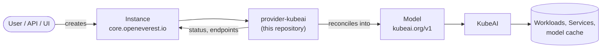

# KubeAI Provider

[](https://github.com/openeverest/provider-kubeai/actions/workflows/ci.yaml)
[](https://pkg.go.dev/github.com/openeverest/provider-kubeai)
[](LICENSE)

Serve **LLMs** on Kubernetes through [OpenEverest](https://github.com/openeverest/openeverest),
backed by [KubeAI](https://www.kubeai.org/) — vLLM on GPU, Ollama on CPU for local demos.

## What this is

OpenEverest providers translate a single, technology-agnostic `Instance` custom resource into
the native custom resources of an upstream Kubernetes operator — for databases, but equally
for caches, message queues, object storage, or model-serving runtimes. This repository is the
provider for **KubeAI**: it owns the technology-specific knowledge — topologies, versions,
parameters — so that users, the API server, and the UI stay technology-agnostic.

> [!IMPORTANT]
> **This provider is not standalone.** It requires an OpenEverest installation (core CRDs and
> controller) in the cluster. Installing this chart on its own does nothing.
> See [Install OpenEverest](https://openeverest.io/documentation/current/quick-install.html).



The provider watches `Instance` resources whose `spec.providerRef.name` is `provider-kubeai`,
and reports workload health back onto `Instance.status`. It never manages pods directly — all
lifecycle work is delegated to KubeAI.

## Compatibility

This provider has **not been released yet** — the table describes `main`.

| provider-kubeai | OpenEverest | KubeAI | Kubernetes |
|---|---|---|---|
| `main` | `>= 2.0.0` | latest release | `1.30` – `1.34` |

## Capabilities

| Capability | Status | Notes |
|---|---|---|
| Provisioning | ✅ | |
| Horizontal scaling | ✅ | request-based autoscaling; `minReplicas` / `maxReplicas` on the topology |
| Vertical scaling (CPU / memory) | ✅ | through the component's `resourceProfile` (e.g. `nvidia-gpu-l4:1`, `cpu:1`) |
| Version upgrades | ✅ | change `spec.version`; see [Versions](#versions) |
| Custom configuration | ✅ | engine `args` and `env` on the `server` component |
| Monitoring | ⚠️ | vLLM exposes Prometheus metrics; see [docs/observability.md](docs/observability.md) |
| TLS | ❌ | not exposed through the Instance API |

Model artefacts are pulled from the URI given in `model.source` (`hf://`, `s3://`, `pvc://`,
`ollama://`), so this provider manages no persistent volumes and has no backup story.

## Installation

> [!NOTE]
> There is no published chart yet. Until the first release, install from a checkout.

```bash
git clone https://github.com/openeverest/provider-kubeai.git
cd provider-kubeai
helm install provider-kubeai charts/provider-kubeai --namespace everest-system
```

`make helm-install` does the same thing against your current kube context.

- KubeAI is **not** bundled. Install it before or alongside the provider, in the **same
  namespace as your Instances**:

  ```bash
  helm repo add kubeai https://www.kubeai.org && helm repo update
  helm upgrade --install kubeai kubeai/kubeai -n default --wait --timeout 10m
  ```

  On GPU clusters use the checked-in values: [deploy/kubeai/values-gpu.yaml](deploy/kubeai/values-gpu.yaml).

Uninstall:

```bash
helm uninstall provider-kubeai --namespace everest-system
```

Uninstalling the chart does **not** delete running `Instance` resources.

## Usage

Verify that the provider registered itself:

```bash
kubectl get providers.core.openeverest.io provider-kubeai
```

Create an instance:

```yaml
apiVersion: core.openeverest.io/v1alpha1
kind: Instance
metadata:
  name: qwen2-05b-cpu
spec:
  providerRef:
    name: provider-kubeai
  topology:
    type: autoscaled
    parameters:
      minReplicas: 1
      maxReplicas: 1
  components:
    server:
      parameters:
        model:
          source: ollama://qwen2:0.5b
        resourceProfile: cpu:1
```

Component names are defined by this provider — see [definition/provider.yaml](definition/provider.yaml).
`spec.version` and `spec.topology` are optional; the provider defaults apply.
More examples live in [examples/](examples/) — [instance-simple.yaml](examples/instance-simple.yaml)
runs on CPU, [instance-gpu.yaml](examples/instance-gpu.yaml) needs an NVIDIA cluster.

Watch it come up and call the model:

```bash
kubectl get instance qwen2-05b-cpu -w
kubectl port-forward svc/kubeai 8000:80
curl -s http://127.0.0.1:8000/openai/v1/models | jq
```

The API is OpenAI-compatible and served under `/openai/v1/...` (not `/v1/...`).

## Topologies

<!-- BEGIN GENERATED: topologies -->
| Topology | Default | Description |
|---|---|---|
| `autoscaled` | ✅ | Request-based autoscaling of the inference server, including scale-to-zero |
<!-- END GENERATED: topologies -->

Topology parameters: `minReplicas`, `maxReplicas`, `targetRequests`, `scaleDownDelaySeconds`.

## Versions

<!-- BEGIN GENERATED: versions -->
| Version bundle | Default | server |
|---|---|---|
| `vllm-0.11.2` | ✅ | `0.11.2` |
| `vllm-0.10.1` | | `0.10.1` |
| `ollama-cpu` | | `0.11.11-ollama` (Ollama, CPU only) |
<!-- END GENERATED: versions -->

Source of truth: [definition/versions.yaml](definition/versions.yaml).

## Configuration

- **Chart values:** [charts/provider-kubeai/values.yaml](charts/provider-kubeai/values.yaml)
- **Instance parameters:** per-component and per-topology `parameters` schemas, defined under
  [definition/](definition/) and published on the `Provider` resource
  (`kubectl get provider provider-kubeai -o yaml`). The API server and the UI validate user
  input against these schemas.

The technology-specific knobs worth knowing about, all on the `server` component:

| Parameter | Purpose |
|---|---|
| `model.source` | Where the model comes from (`hf://`, `s3://`, `pvc://`, `ollama://`) |
| `model.estimatedParamBillions`, `model.quantization` | Hints KubeAI uses for scheduling and profile selection |
| `resourceProfile` | KubeAI resource profile, e.g. `cpu:1` or `nvidia-gpu-l4:1` |
| `cacheProfile` | KubeAI cache profile for model artefacts |
| `args`, `env` | Extra engine arguments and environment variables |

## Development

Requires Go (see [go.mod](go.mod)), Docker, Helm, kubectl, and a Kubernetes cluster you can
reach. For local development we recommend [k3d](https://k3d.io) — `make dev-up` creates the
cluster for you. Step-by-step runbooks: [k3d](docs/local-k3d-runbook.md),
[kind](docs/local-kind-runbook.md), [GPU](docs/gpu-runbook.md).

```bash
make dev-up             # local k3d cluster + Tilt dev environment
make generate           # RBAC, provider spec, Helm chart sync
make run                # run the provider locally against the cluster
make test               # unit tests
make test-integration   # chainsaw suites
make dev-down
```

To work against a cluster you already have — kind, GKE, a shared dev cluster — skip
`make dev-up` and point Tilt at it:

```bash
cp dev/.env.example dev/.env   # set K8S_CONTEXT, and DOCKER_REGISTRY_URL for a remote registry
tilt up -f dev/Tiltfile
```

`make help` lists every target. `make verify` fails when generated files are stale — run
`make generate` and commit the result.

The provider contract (`Validate` / `Sync` / `Status` / `Cleanup`), RBAC markers, watches,
and code generation are documented once for all providers in
[PROVIDER_DEVELOPMENT.md](https://github.com/openeverest/provider-sdk/blob/main/PROVIDER_DEVELOPMENT.md).

### Layout

| Path | Purpose |
|---|---|
| `cmd/provider/` | Entry point |
| `internal/provider/` | `ProviderInterface` implementation, RBAC markers |
| `internal/common/` | Component name constants |
| `definition/` | Provider identity, component types, versions, topologies |
| `charts/provider-kubeai/` | Helm chart (`generated/` is produced by `make generate`) |
| `config/rbac/role.yaml` | Generated `ClusterRole` — do not edit |
| `deploy/` | KubeAI and Prometheus values used by the runbooks |
| `docs/` | k3d, kind, GPU and observability runbooks |
| `examples/` | Example `Instance` resources and a Grafana dashboard |
| `dev/` | Tilt dev environment, `.env` configuration, k3d cluster config |
| `.github/workflows/` | CI: lint, build, unit and integration tests, release |

### Testing

- **Unit tests** — `make test`.
- **Integration tests** — `make test-integration` runs the chainsaw suites.
- **CI** — [.github/workflows/ci.yaml](.github/workflows/ci.yaml) runs lint, build, unit
  tests, generated-file verification, and Helm lint on every pull request.

## Troubleshooting

```bash
kubectl logs -n everest-system deploy/provider-kubeai -f
```

| Symptom | Where to look |
|---|---|
| `Instance` stuck in `Creating` | `kubectl describe instance <name>` conditions, then the provider logs |
| No `Provider` resource in the cluster | Is the chart installed? Check the provider deployment logs |
| `Instance` ignored entirely | `spec.providerRef.name` must be `provider-kubeai` |
| `Model` created but no pods | KubeAI must run in the same namespace as the Instance; check the KubeAI controller logs |
| Requests return 404 | Use `/openai/v1/...`, and make sure the `model` field matches the Instance name |
| CPU model takes minutes to answer | Ollama cold starts are slow; pin `minReplicas: 1` to avoid scale-to-zero |

## Contributing

Issues and pull requests are welcome. See [CONTRIBUTING.md](CONTRIBUTING.md),
[PROVIDER_DEVELOPMENT.md](https://github.com/openeverest/provider-sdk/blob/main/PROVIDER_DEVELOPMENT.md)
and the [OpenEverest Code of Conduct](https://github.com/openeverest/openeverest/blob/main/CODE_OF_CONDUCT.md).

## Security

Report vulnerabilities per the
[OpenEverest security policy](https://github.com/openeverest/openeverest/blob/main/SECURITY.md).
Please do not open public issues for security reports.

## License

Apache License 2.0 — see [LICENSE](LICENSE) for details.
